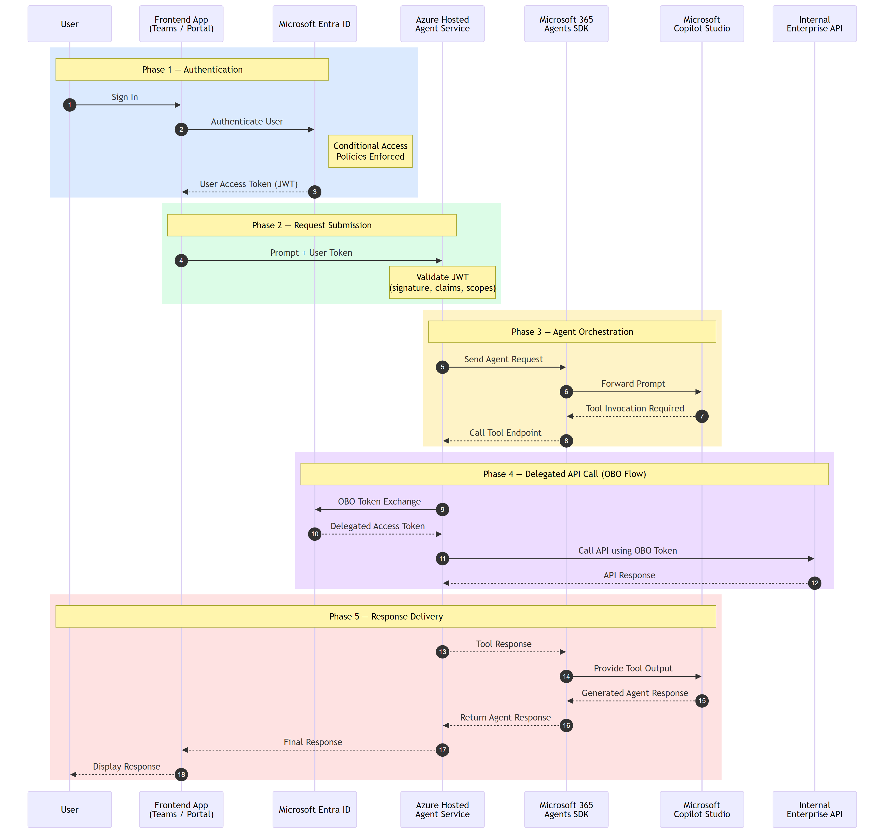

# Pattern 1 — Azure Hosted Agent Service



## Demo

https://github.com/user-attachments/assets/01-HostedAgentService-video.mp4

> **▶ [Watch the demo video](../docs/videos/01-HostedAgentService-video.mp4)** —
> walkthrough of the end-to-end Hosted Agent Service pattern: user sign-in via
> Entra ID SSO, prompt submission through the frontend, agent orchestration, and
> Enterprise API call with OBO token exchange.

## When to Use This Pattern

Use this pattern when you need to:

- **Expose a Copilot Studio agent through a custom web UI** rather than embedding
  the default Copilot Studio chat widget or publishing to Teams/SharePoint.
- **Add a backend orchestration layer** between the user and the AI agent — for
  example, to enrich prompts, enforce business rules, call additional APIs, or
  aggregate responses before returning them to the frontend.
- **Flow the signed-in user's identity end-to-end** from a frontend app through
  an intermediary service to downstream APIs using On-Behalf-Of (OBO) token
  exchanges, ensuring every hop is authenticated as the original user.
- **Keep secrets server-side** — the frontend never holds Power Platform API
  tokens or Enterprise API tokens; only the backend Agent Service performs OBO
  exchanges and calls downstream services.

> **Not the right fit?** If you only need the default chat experience inside
> Teams or a website widget, consider the Bot Service patterns
> ([Pattern 2](../02-botservice-teams/) / [Pattern 3](../03-botservice-directline/))
> or the Agents SDK client ([Pattern 4](../04-agents-sdk-direct-to-engine/)).

## Overview

This pattern demonstrates an **Azure-hosted agent service** where a frontend web
application authenticates the user via Entra ID SSO, then delegates prompt
processing to a backend Agent Service. The Agent Service validates the user's JWT,
orchestrates a call to a **real Microsoft Copilot Studio agent** using the
`CopilotClient` from the **Microsoft.Agents.CopilotStudio.Client** SDK
(with OBO authentication), and performs an additional **On-Behalf-Of (OBO)**
token exchange to call a shared Enterprise API as the signed-in user.

## Components

| Component | Port | Description |
|---|---|---|
| **FrontendApp** | `5010` | Razor Pages app with MSAL / OpenID Connect SSO |
| **AgentService** | `5020` | ASP.NET Core API — JWT validation, Copilot Studio conversations API, OBO |
| **Enterprise API** | `5050` | Shared downstream API (see `shared/enterprise-api`) |

## Auth Flow

```
User → FrontendApp (OIDC sign-in) → acquires token for AgentService scope
     → POST /api/agent/invoke (Bearer token)
     → AgentService validates JWT
     → OBO exchange: user token → Power Platform API token (CopilotStudio.Copilots.Invoke)
     → CopilotClient SDK (Direct-to-Engine):
         1. StartConversationAsync → streams greeting activities via SSE
         2. AskQuestionAsync(prompt) → streams bot reply activities via SSE
     → OBO exchange: user token → Enterprise API token
     → GET /api/me on Enterprise API
     → combined response returned to frontend
```

## Prerequisites

1. **.NET 8 SDK** (or later)
2. **Three Entra ID app registrations:**
   - **Frontend App** — redirect URI `http://localhost:5010/signin-oidc`
   - **Agent Service** — expose an API scope `access_as_user`; grant the Frontend
     App permission to call it; add a client secret; add delegated permission for
     Power Platform API (`CopilotStudio.Copilots.Invoke`)
   - **Enterprise API** — expose an API scope `access_as_user`; grant the Agent
     Service permission to call it via OBO
3. **A published Copilot Studio agent** with authenticated access enabled.
   You'll need the agent's conversations endpoint URL (available in Copilot Studio
   under Settings → Advanced → Copilot Studio API endpoint).

## App Registration Setup (Brief)

1. Register **Enterprise API** → expose scope `api://<ENTERPRISE_API_CLIENT_ID>/access_as_user`.
2. Register **Agent Service** → expose scope `api://<AGENT_SERVICE_CLIENT_ID>/access_as_user`;
   add API permission for Enterprise API scope; create a client secret.
3. Register **Frontend App** → add API permission for Agent Service scope;
   set redirect URI to `http://localhost:5010/signin-oidc`; create a client secret.
4. Add **Power Platform API** delegated permission (`CopilotStudio.Copilots.Invoke`)
   to the Agent Service app registration; grant admin consent.
5. Update `appsettings.json` in each project with the corresponding client IDs,
   tenant ID, secrets, and Copilot Studio endpoint URL.

> **Important — Exposing Scopes on Windows PowerShell:**
> The `az ad app update --set api.oauth2PermissionScopes=...` command can silently
> fail due to PowerShell JSON escaping issues. Use the Microsoft Graph REST API
> (`az rest --method PATCH`) instead. See [`runPattern-1.md`](runPattern-1.md)
> for the full scripted setup with the correct commands.

### Scripted Setup (PowerShell)

```powershell
# 1. Register all three apps
$eapi = az ad app create --display-name "EnterpriseAPI" --sign-in-audience AzureADMyOrg -o json | ConvertFrom-Json
$agent = az ad app create --display-name "AgentService" --sign-in-audience AzureADMyOrg -o json | ConvertFrom-Json
$frontend = az ad app create --display-name "FrontendApp" --sign-in-audience AzureADMyOrg `
  --web-redirect-uris "http://localhost:5010/signin-oidc" -o json | ConvertFrom-Json

# 2. Set identifier URIs
az ad app update --id $eapi.appId --identifier-uris "api://$($eapi.appId)"
az ad app update --id $agent.appId --identifier-uris "api://$($agent.appId)"

# 3. Expose access_as_user scopes via Graph API (see runPattern-1.md for full JSON body)
#    Use: az rest --method PATCH --url "https://graph.microsoft.com/v1.0/applications/<objectId>" ...

# 4. Add API permissions
$eapiScopeId = az ad app show --id $eapi.appId --query "api.oauth2PermissionScopes[0].id" -o tsv
$agentScopeId = az ad app show --id $agent.appId --query "api.oauth2PermissionScopes[0].id" -o tsv
az ad app permission add --id $agent.appId --api $eapi.appId --api-permissions "$eapiScopeId=Scope"
az ad app permission add --id $frontend.appId --api $agent.appId --api-permissions "$agentScopeId=Scope"

# 5. Create client secrets
$agentSecret = (az ad app credential reset --id $agent.appId --display-name dev-secret --years 1 -o json | ConvertFrom-Json).password
$frontendSecret = (az ad app credential reset --id $frontend.appId --display-name dev-secret --years 1 -o json | ConvertFrom-Json).password

# 6. Create service principals & grant admin consent
az ad sp create --id $eapi.appId; az ad sp create --id $agent.appId; az ad sp create --id $frontend.appId
Start-Sleep -Seconds 5
az ad app permission admin-consent --id $agent.appId
az ad app permission admin-consent --id $frontend.appId
```

## How to Run

> **Note:** The FrontendApp requires a `ClientSecret` in its `appsettings.json`
> under the `AzureAd` section. This is needed because it's a confidential client
> that acquires tokens to call the Agent Service API.

```bash
# 1. Start the Enterprise API (shared) — from the repo root
cd shared/enterprise-api
dotnet run

# 2. Start the Agent Service — in a new terminal
cd 01-hosted-agent-service/src/AgentService
dotnet run

# 3. Start the Frontend App — in a new terminal
cd 01-hosted-agent-service/src/FrontendApp
dotnet run

# 4. Open the frontend
# Navigate to http://localhost:5010
```

## CopilotClient SDK Integration

The Agent Service communicates with Copilot Studio using `CopilotClient` from the
[`Microsoft.Agents.CopilotStudio.Client`](https://www.nuget.org/packages/Microsoft.Agents.CopilotStudio.Client)
NuGet package. The SDK handles:

- **SSE streaming** — responses arrive as `IAsyncEnumerable<Activity>`, properly
  handling Server-Sent Events from the Direct-to-Engine endpoint.
- **Conversation lifecycle** — `StartConversationAsync()` and `AskQuestionAsync()`
  manage conversation state, retries, and error handling.
- **Token management** — a token provider function is called on demand; this sample
  uses `ITokenAcquisition.GetAccessTokenForUserAsync()` to perform OBO exchange
  for the `CopilotStudio.Copilots.Invoke` scope.

Configuration requires only `EnvironmentId` and `SchemaName` from Copilot Studio
(Settings → Advanced → Metadata).

## What This Proves

- **Frontend SSO** — user signs in via Entra ID; token acquired for Agent Service.
- **JWT validation** — Agent Service validates the token using Microsoft.Identity.Web.
- **Copilot Studio integration** — real call to a Copilot Studio agent via the
  `CopilotClient` SDK with SSE streaming, using an OBO token for the Power
  Platform API (`CopilotStudio.Copilots.Invoke` scope).
- **OBO token exchange** — Agent Service exchanges the user token for downstream
  tokens scoped to both the Power Platform API and the Enterprise API.
- **Enterprise API call** — the user's identity flows through the entire chain.
