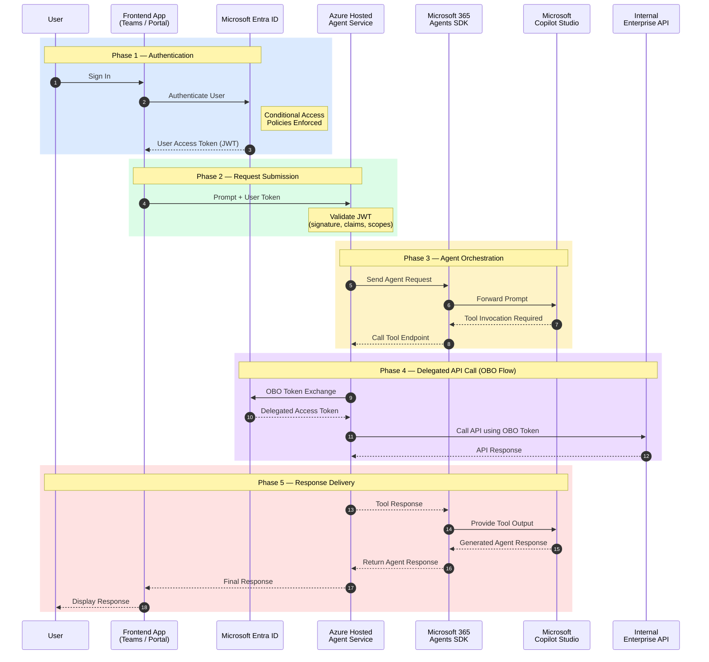
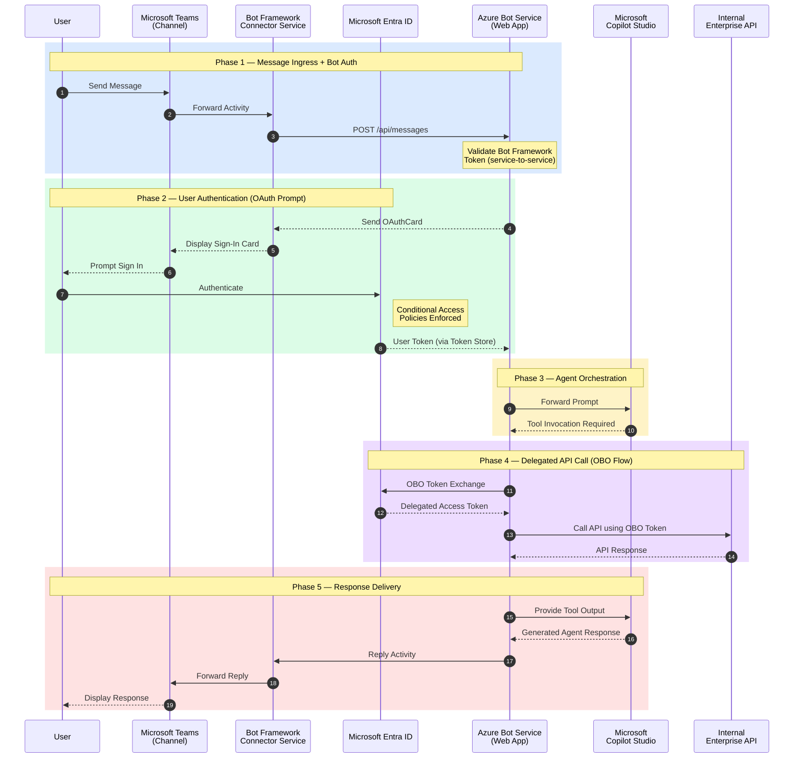
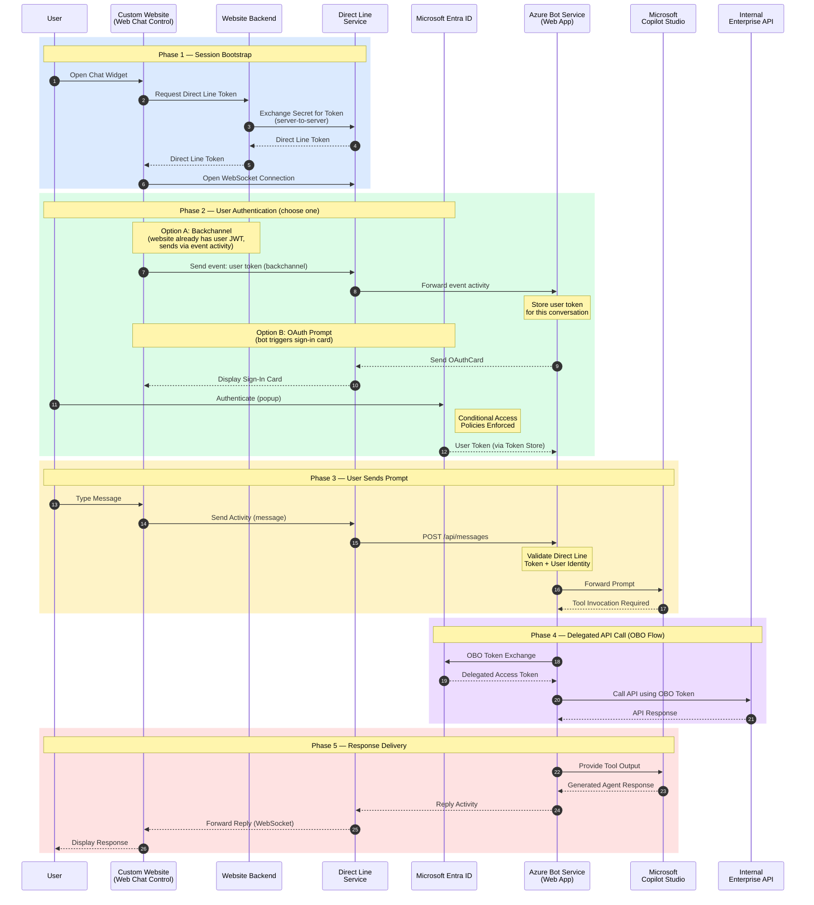
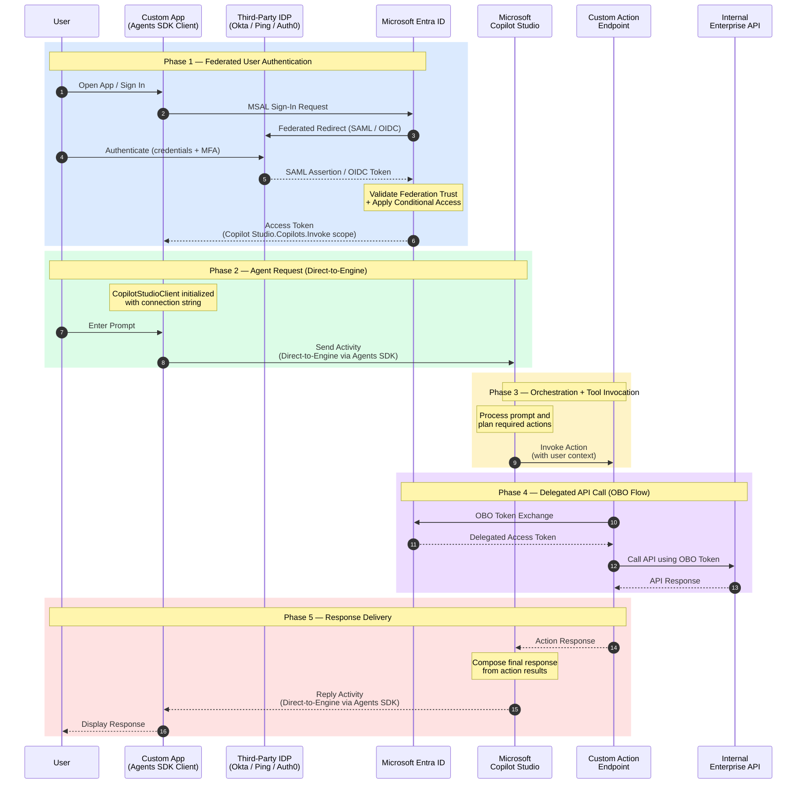
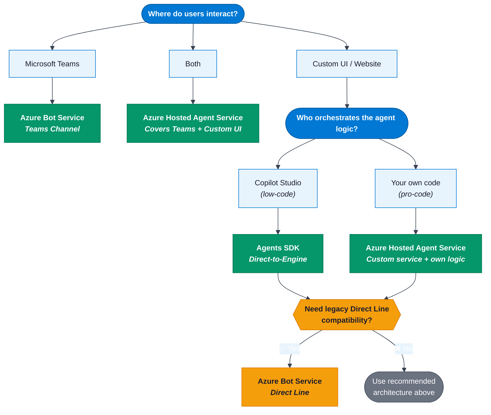

# Azure Agent Architectures — Comparison Guide

> A side-by-side comparison of four approaches to building AI agent experiences on Azure:  
> Azure Hosted Agent Service, Azure Bot Service (Teams), Azure Bot Service (Direct Line), and Microsoft 365 Agents SDK (Direct-to-Engine).

> **Legend:** Solid arrows (`->>`) = requests/calls · Dashed arrows (`-->>`) = responses/returns  
> Colored blocks group the 5 common phases across all diagrams:  
> 🔵 Authentication · 🟢 Request Submission · 🟡 Orchestration · 🟣 OBO / API Call · 🔴 Response Delivery

> **⚠️ Note:** Some features of the Microsoft 365 Agents SDK (e.g., Direct-to-Engine, CopilotStudioClient) may be in **preview** at the time of reading. Check [Microsoft Learn](https://learn.microsoft.com/microsoft-365/agents-sdk/agents-sdk-overview) for current availability and GA status.

---

## 1. Azure Hosted Agent Service

A custom-built agent service hosted on Azure (e.g., App Service, Container Apps) that uses the Microsoft 365 Agents SDK server-side and delegates orchestration to Copilot Studio. The frontend (Teams, Portal, or custom UI) authenticates the user and passes the JWT directly.

> **Terminology note:** "Azure Hosted Agent Service" is an **architectural pattern** — not a specific Azure product. It refers to any custom-built agent service you host on Azure compute.

**Best for:** Teams/Portal-first deployments where you own the agent service and orchestration logic.

---

## 2. Azure Bot Service — Teams Channel

The traditional Bot Framework pattern for Teams-first experiences. Messages flow through the Bot Framework Connector Service, and the bot triggers an OAuth Prompt for user sign-in.

**Best for:** Teams-first distribution where the bot is the primary interaction surface.

---

## 3. Azure Bot Service — Custom Website (Direct Line)

When users interact via a custom website or UI app, Azure Bot Service uses the Direct Line channel. The website embeds the Web Chat control or calls the Direct Line REST/WebSocket API. A server-side secret-to-token exchange bootstraps the session.

**Best for:** Custom UI with existing Bot Framework investment, or when Agents SDK doesn't support your scenario (e.g., service principal tokens).

---

## 4. Microsoft 365 Agents SDK — Direct-to-Engine (with Third-Party IDP)

The modern approach: the Agents SDK `CopilotStudioClient` connects **directly to Copilot Studio** (Direct-to-Engine) — no Bot Connector, no Direct Line. Copilot Studio is the **orchestrator** that calls your tool endpoints. User authentication flows through a **federated third-party IDP** (e.g., Okta, Ping, Auth0) via Entra ID.

**Best for:** Modern custom apps, Copilot Studio-orchestrated agents, enterprises with third-party IDPs.

---

## Master Comparison Table

| Aspect | Hosted Agent Svc | Bot Svc (Teams) | Bot Svc (Direct Line) | Agents SDK (Direct-to-Engine) |
|--------|:---:|:---:|:---:|:---:|
| **Total steps** | 18 | 19 | 26 (both auth options shown) | 16 |
| **Participants** | 7 | 7 | 8 | 7 |
| **Extra hops** | 0 | +2 (Connector) | +2 (DL + Backend) | 0 |
| **Channel layer** | Direct HTTP | Teams + Connector | Direct Line | Agents SDK protocol |
| **User auth** | Frontend SSO (JWT) | OAuth Prompt (card) | Backchannel / OAuth | Federated IDP → Entra ID |
| **Third-party IDP** | Custom integration | Not native | Not native | **Federated via Entra ID** |
| **Session bootstrap** | None | None | Secret → Token | Connection string (config) |
| **Orchestrator** | Agent Service + SDK | Bot code | Bot code | **Copilot Studio** |
| **Who calls tools?** | Agent Service | Bot | Bot | **Copilot Studio** |
| **OBO performed by** | Agent Service | Bot | Bot | Custom Action Endpoint |
| **Custom UI** | ✅ Full control | ❌ Teams only | ✅ Web Chat | ✅ Full control |
| **SDK in client app** | None (HTTP) | N/A | Web Chat (React) | Agents SDK (.NET/JS/Python) |

---

## Decision Guide

---

## References

- [Microsoft 365 Agents SDK Overview](https://learn.microsoft.com/microsoft-365/agents-sdk/agents-sdk-overview)
- [Activity Protocol](https://learn.microsoft.com/microsoft-365/agents-sdk/activity-protocol)
- [Integrate with Web/Native Apps via Agents SDK](https://learn.microsoft.com/microsoft-copilot-studio/publication-integrate-web-or-native-app-m365-agents-sdk)
- [Azure Bot Service — Connect to Direct Line](https://learn.microsoft.com/azure/bot-service/bot-service-channel-connect-directline)
- [Azure Bot Service — Connect to Web Chat](https://learn.microsoft.com/azure/bot-service/bot-service-channel-connect-webchat)
- [Entra ID — SAML/WS-Fed Federation with External IDPs](https://learn.microsoft.com/entra/external-id/direct-federation-overview)
- [Configure OAuth in Agents SDK (.NET)](https://learn.microsoft.com/microsoft-365/agents-sdk/configure-oauth)
